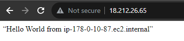

# aws-workshop-challenge
AWS Workshop Challenge

**This Repository has been created for 12 Week AWS Workshop Challenge by Prasad Rao**

Follow the week by week instructions to get a handson with the AWS Services

These labs are for the learning and hands-on for terraform using VS Code and assume that you have understanding knowledge of AWS services and concepts

## Setup
Before we will go deep dive to workskop, lets create environment set up. This is one time set up and can be used in future challenge.

1. ***`Free account in AWS`*** - Link: https://aws.amazon.com/free/
2. ***`Install VS Code.`*** - Download link - https://code.visualstudio.com/Download
3. ***`Install Terraform.`*** - Setup Terraform Locally - https://www.youtube.com/watch?v=ljYzclmsvF4
4. ***`Install AWS CLI.`*** - Installing AWS CLI - https://www.youtube.com/watch?v=u0JyzUGzvJA
5. ***`Configure aws cli to be used in Terraform.`*** - Configure AWS CLI with Terraform - https://www.youtube.com/watch?v=XxTcw7UTues


Important Terraform commands.
1. ***`terraform init `*** - This command is used for initialize the terraform.
2. ***` terraform fmt `*** -  This command is used for format the terraform code.
3. ***` terraform validate `*** - This command is used for validate the terraform code.
4. ***` terraform plan `*** - This command is used to describe the plan. This is highly recommended to run before apply the changes.
5. ***` terraform apply `*** - If you are statisfy with changes, run this command to apply the changes.
6. ***` terraform destroy `*** - This command is used to destroy the resources created

# Week 1 - AWS General Immersion Days
## 1. Key Pair Creation

Terraform script to create AWS EC2 Key Pair. Rememer to add the key to .gitignore file, otherwise private key will be exposed to public git repo

```terraform {
  required_providers {
    aws = {
      source  = "hashicorp/aws"
      version = "~> 3.5.0"
    }
  }
}

# Configure the AWS Provider
provider "aws" {
  region = "us-east-1"
}

# Create a Key pair

resource "aws_key_pair" "WorkshopKeyPair" {
  key_name   = "WorkshopKeyPair"
  public_key = tls_private_key.rsa.public_key_openssh
}

# RSA key of size 4096 bits
resource "tls_private_key" "rsa" {
  algorithm = "RSA"
  rsa_bits  = 4096
}

# Create a local file
resource "local_file" "WorkshopKeyPair" {
  content  = tls_private_key.rsa.private_key_pem
  filename = "WorkshopKeyPair"
}
```


## 2. Web Tier EC2 Linux

main.tf - create various resources (VPC, internet gateway, subnet, route table, web EC2 instance with userdata)

```
terraform {
  required_providers {
    aws = {
      source  = "hashicorp/aws"
      version = "~> 3.0"
    }
  }
}

# Configure the AWS Provider
provider "aws" {
  region  = var.region
  profile = var.profile_name
}

# Create a VPC
resource "aws_vpc" "app_vpc" {
  cidr_block = var.vpc_cidr

  tags = {
    Name = "app-vpc"
  }
}

resource "aws_internet_gateway" "igw" {
  vpc_id = aws_vpc.app_vpc.id

  tags = {
    Name = "vpc_igw"
  }
}

resource "aws_subnet" "public_subnet" {
  vpc_id                  = aws_vpc.app_vpc.id
  cidr_block              = var.public_subnet_cidr
  map_public_ip_on_launch = true
  availability_zone       = "us-east-1a"

  tags = {
    Name = "public-subnet"
  }
}

resource "aws_route_table" "public_rt" {
  vpc_id = aws_vpc.app_vpc.id

  route {
    cidr_block = "0.0.0.0/0"
    gateway_id = aws_internet_gateway.igw.id
  }

  tags = {
    Name = "public_rt"
  }
}

resource "aws_route_table_association" "public_rt_asso" {
  subnet_id      = aws_subnet.public_subnet.id
  route_table_id = aws_route_table.public_rt.id
}

resource "aws_instance" "web" {
  ami             = "ami-067d1e60475437da2"
  instance_type   = var.instance_type
  key_name        = var.instance_key
  subnet_id       = aws_subnet.public_subnet.id
  security_groups = [aws_security_group.sg.id]

  user_data = <<-EOF
  #!/bin/bash
  yum update -y
  yum install -y httpd.x86_64
  systemctl start httpd.service
  systemctl enable httpd.service
  echo “Hello World from $(hostname -f)” > /var/www/html/index.html
  EOF

  tags = {
    Name = "web_instance"
  }

  volume_tags = {
    Name = "web_instance"
  }
}
```
sg.tf - create security group with ingress, egress rules

```
resource "aws_security_group" "sg" {
  name        = "allow_ssh_http"
  description = "Allow ssh http inbound traffic"
  vpc_id      = aws_vpc.app_vpc.id

  ingress {
    description      = "SSH from VPC"
    from_port        = 22
    to_port          = 22
    protocol         = "tcp"
    cidr_blocks      = ["0.0.0.0/0"]
    ipv6_cidr_blocks = ["::/0"]
  }

  ingress {
    description      = "HTTP from VPC"
    from_port        = 80
    to_port          = 80
    protocol         = "tcp"
    cidr_blocks      = ["0.0.0.0/0"]
    ipv6_cidr_blocks = ["::/0"]
  }

  egress {
    from_port        = 0
    to_port          = 0
    protocol         = "-1"
    cidr_blocks      = ["0.0.0.0/0"]
    ipv6_cidr_blocks = ["::/0"]
  }

  tags = {
    Name = "allow_ssh_http"
  }
}
```

variables.tf
```
tervariable "region" {
  default = "us-east-1"
}
variable "instance_type" {
  default = "t2.micro"
}
variable "profile_name" {
  default = "default"
}
variable "instance_key" {
  default = "WorkshopKeyPair"
}
variable "vpc_cidr" {
  default = "178.0.0.0/16"
}
variable "public_subnet_cidr" {
  default = "178.0.10.0/24"
}
```

Terraform apply output:
```
Plan: 7 to add, 0 to change, 0 to destroy.

Changes to Outputs:
  + web_instance_ip = (known after apply)

Do you want to perform these actions?
  Terraform will perform the actions described above.
  Only 'yes' will be accepted to approve.

  Enter a value: yes

aws_vpc.app_vpc: Creating...
aws_vpc.app_vpc: Still creating... [10s elapsed]
aws_vpc.app_vpc: Creation complete after 15s [id=vpc-086b83896c0a21e6f]
aws_internet_gateway.igw: Creating...
aws_subnet.public_subnet: Creating...
aws_security_group.sg: Creating...
aws_subnet.public_subnet: Creation complete after 5s [id=subnet-0194c93a3bc7391a3]
aws_internet_gateway.igw: Creation complete after 7s [id=igw-01001a8a1449d6cf7]
aws_route_table.public_rt: Creating...
aws_security_group.sg: Still creating... [10s elapsed]
aws_route_table.public_rt: Creation complete after 5s [id=rtb-00186857be3b7a8b3]
aws_route_table_association.public_rt_asso: Creating...
aws_route_table_association.public_rt_asso: Creation complete after 1s [id=rtbassoc-0909dd9e13fc35235]
aws_instance.web: Still creating... [10s elapsed]
aws_instance.web: Still creating... [20s elapsed]
aws_instance.web: Still creating... [30s elapsed]
aws_instance.web: Still creating... [40s elapsed]
aws_instance.web: Creation complete after 50s [id=i-0c171d35ffc6810b7]

Apply complete! Resources: 7 added, 0 changed, 0 destroyed.

Outputs:

web_instance_ip = "18.212.26.65"
```

Running website:



Terraform Destroy output:

```
Plan: 0 to add, 0 to change, 7 to destroy.

Changes to Outputs:
  - web_instance_ip = "18.212.26.65" -> null

Do you really want to destroy all resources?
  Terraform will destroy all your managed infrastructure, as shown above.
  There is no undo. Only 'yes' will be accepted to confirm.

  Enter a value: yes

aws_route_table_association.public_rt_asso: Destroying... [id=rtbassoc-0909dd9e13fc35235]
aws_instance.web: Destroying... [id=i-0c171d35ffc6810b7]
aws_route_table_association.public_rt_asso: Destruction complete after 1s
aws_route_table.public_rt: Destroying... [id=rtb-00186857be3b7a8b3]
aws_route_table.public_rt: Destruction complete after 4s
aws_internet_gateway.igw: Destroying... [id=igw-01001a8a1449d6cf7]
aws_instance.web: Still destroying... [id=i-0c171d35ffc6810b7, 10s elapsed]
aws_internet_gateway.igw: Still destroying... [id=igw-01001a8a1449d6cf7, 10s elapsed]
aws_instance.web: Still destroying... [id=i-0c171d35ffc6810b7, 20s elapsed]
aws_internet_gateway.igw: Destruction complete after 20s
aws_instance.web: Still destroying... [id=i-0c171d35ffc6810b7, 30s elapsed]
aws_instance.web: Destruction complete after 35s
aws_subnet.public_subnet: Destroying... [id=subnet-0194c93a3bc7391a3]
aws_security_group.sg: Destroying... [id=sg-0df562e27ee45d912]
aws_security_group.sg: Destruction complete after 3s
aws_subnet.public_subnet: Destruction complete after 3s
aws_vpc.app_vpc: Destroying... [id=vpc-086b83896c0a21e6f]
aws_vpc.app_vpc: Destruction complete after 1s

Destroy complete! Resources: 7 destroyed.
```