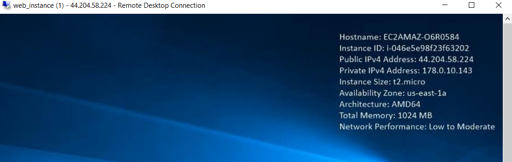

# aws-workshop-challenge
AWS Workshop Challenge

**This Repository has been created for 12 Week AWS Workshop Challenge by Prasad Rao**

Follow the week by week instructions to get a handson with the AWS Services

These labs are for the learning and hands-on for terraform using VS Code and assume that you have understanding knowledge of AWS services and concepts

## Setup
Before we will go deep dive to workskop, lets create environment set up. This is one time set up and can be used in future challenge.

1. ***`Free account in AWS`*** - Link: https://aws.amazon.com/free/
2. ***`Install VS Code.`*** - Download link - https://code.visualstudio.com/Download
3. ***`Install Terraform.`*** - Setup Terraform Locally - https://www.youtube.com/watch?v=ljYzclmsvF4
4. ***`Install AWS CLI.`*** - Installing AWS CLI - https://www.youtube.com/watch?v=u0JyzUGzvJA
5. ***`Configure aws cli to be used in Terraform.`*** - Configure AWS CLI with Terraform - https://www.youtube.com/watch?v=XxTcw7UTues


Important Terraform commands.
1. ***`terraform init `*** - This command is used for initialize the terraform.
2. ***` terraform fmt `*** -  This command is used for format the terraform code.
3. ***` terraform validate `*** - This command is used for validate the terraform code.
4. ***` terraform plan `*** - This command is used to describe the plan. This is highly recommended to run before apply the changes.
5. ***` terraform apply `*** - If you are statisfy with changes, run this command to apply the changes. Use -auto-approve to skip the question
6. ***` terraform destroy `*** - This command is used to destroy the resources created. Use -auto-approve to skip the question

# Week 1 - AWS General Immersion Days
## 1. Key Pair Creation

Terraform script to create AWS EC2 Key Pair. Rememer to add the key to .gitignore file, otherwise private key will be exposed to public git repo

```
terraform {
  required_providers {
    aws = {
      source  = "hashicorp/aws"
      version = "~> 3.5.0"
    }
  }
}

# Configure the AWS Provider
provider "aws" {
  region = "us-east-1"
}

# Create a Key pair

resource "aws_key_pair" "WorkshopKeyPair" {
  key_name   = "WorkshopKeyPair"
  public_key = tls_private_key.rsa.public_key_openssh
}

# RSA key of size 4096 bits
resource "tls_private_key" "rsa" {
  algorithm = "RSA"
  rsa_bits  = 4096
}

# Create a local file
resource "local_file" "WorkshopKeyPair" {
  content  = tls_private_key.rsa.private_key_pem
  filename = "WorkshopKeyPair"
}
```


## 2. Web Tier EC2 Linux

main.tf - create various resources (provider and web EC2 instance with userdata)

```
terraform {
  required_providers {
    aws = {
      source  = "hashicorp/aws"
      version = "~> 3.0"
    }
  }
}

# Configure the AWS Provider
provider "aws" {
  region  = var.region
  profile = var.profile_name
}

# Get latest Amazon Linux 2 AMI
data "aws_ami" "amazon-linux-2" {
  most_recent = true
  owners      = ["amazon"]
  filter {
    name   = "name"
    values = ["amzn2-ami-hvm*"]
  }
}

# Create the Linux EC2 Web server
resource "aws_instance" "web" {
  ami             = data.aws_ami.amazon-linux-2.id
  instance_type   = var.instance_type
  key_name        = var.instance_key
  subnet_id       = aws_subnet.public_subnet.id
  security_groups = [aws_security_group.sg.id]

  user_data = <<-EOF
  #!/bin/bash
  yum update -y
  yum install -y httpd.x86_64
  systemctl start httpd.service
  systemctl enable httpd.service
  instanceId=$(curl http://169.254.169.254/latest/meta-data/instance-id)
   echo “AWS Linux VM Deployed with Terraform with instance id $instanceId” > /var/www/html/index.html
  EOF

  tags = {
    Name = "web_instance"
  }

  volume_tags = {
    Name = "web_instance"
  }
}
```
network.tf - Create VPC (VPC, internet gateway, subnet, route table)

```
# Create the VPC
resource "aws_vpc" "app_vpc" {
  cidr_block = var.vpc_cidr

  tags = {
    Name = "app-vpc"
  }
}

# Create the internet gateway
resource "aws_internet_gateway" "igw" {
  vpc_id = aws_vpc.app_vpc.id

  tags = {
    Name = "vpc_igw"
  }
}

# Create the public subnet
resource "aws_subnet" "public_subnet" {
  vpc_id                  = aws_vpc.app_vpc.id
  cidr_block              = var.public_subnet_cidr
  map_public_ip_on_launch = true
  availability_zone       = "us-east-1a"

  tags = {
    Name = "public-subnet"
  }
}

# Create the route table
resource "aws_route_table" "public_rt" {
  vpc_id = aws_vpc.app_vpc.id

  route {
    cidr_block = "0.0.0.0/0"
    gateway_id = aws_internet_gateway.igw.id
  }

  tags = {
    Name = "public_rt"
  }
}

# Assign the public route table to the public subnet
resource "aws_route_table_association" "public_rt_asso" {
  subnet_id      = aws_subnet.public_subnet.id
  route_table_id = aws_route_table.public_rt.id
}
```

sg.tf - create security group with ingress, egress rules

```
# Create the security group
resource "aws_security_group" "sg" {
  name        = "allow_ssh_http"
  description = "Allow ssh http inbound traffic"
  vpc_id      = aws_vpc.app_vpc.id

  ingress {
    description      = "SSH from VPC"
    from_port        = 22
    to_port          = 22
    protocol         = "tcp"
    cidr_blocks      = ["0.0.0.0/0"]
    ipv6_cidr_blocks = ["::/0"]
  }

  ingress {
    description      = "HTTP from VPC"
    from_port        = 80
    to_port          = 80
    protocol         = "tcp"
    cidr_blocks      = ["0.0.0.0/0"]
    ipv6_cidr_blocks = ["::/0"]
  }

  egress {
    from_port        = 0
    to_port          = 0
    protocol         = "-1"
    cidr_blocks      = ["0.0.0.0/0"]
    ipv6_cidr_blocks = ["::/0"]
  }

  tags = {
    Name = "allow_ssh_http"
  }
}
```

variables.tf
```
tervariable "region" {
  default = "us-east-1"
}
variable "instance_type" {
  default = "t2.micro"
}
variable "profile_name" {
  default = "default"
}
variable "instance_key" {
  default = "WorkshopKeyPair"
}
variable "vpc_cidr" {
  default = "178.0.0.0/16"
}
variable "public_subnet_cidr" {
  default = "178.0.10.0/24"
}
```

Terraform apply output:
```
Plan: 7 to add, 0 to change, 0 to destroy.

Changes to Outputs:
  + web_instance_id = (known after apply)
  + web_instance_ip = (known after apply)
aws_vpc.app_vpc: Creating...
aws_vpc.app_vpc: Still creating... [10s elapsed]
aws_vpc.app_vpc: Creation complete after 13s [id=vpc-0a73436b4fd4778af]
aws_internet_gateway.igw: Creating...
aws_subnet.public_subnet: Creating...
aws_security_group.sg: Creating...
aws_subnet.public_subnet: Creation complete after 5s [id=subnet-0c1590bd8528b6594]
aws_internet_gateway.igw: Creation complete after 6s [id=igw-063dbcfdd22dab1b8]
aws_route_table.public_rt: Creating...
aws_security_group.sg: Still creating... [10s elapsed]
aws_security_group.sg: Creation complete after 10s [id=sg-0ddcfe1f981f66733]
aws_instance.web: Creating...
aws_route_table.public_rt: Creation complete after 5s [id=rtb-03cad53d564069fe8]
aws_route_table_association.public_rt_asso: Creating...
aws_route_table_association.public_rt_asso: Creation complete after 2s [id=rtbassoc-05d129e8c110febe8]
aws_instance.web: Still creating... [10s elapsed]
aws_instance.web: Still creating... [20s elapsed]
aws_instance.web: Still creating... [30s elapsed]
aws_instance.web: Still creating... [40s elapsed]
aws_instance.web: Creation complete after 49s [id=i-04e12b8b6ade18b61]

Apply complete! Resources: 7 added, 0 changed, 0 destroyed.

Outputs:

web_instance_id = "i-04e12b8b6ade18b61"
web_instance_ip = "44.202.80.228"
```

Running website:


Terraform Destroy output:

```
Plan: 0 to add, 0 to change, 7 to destroy.

Changes to Outputs:
  - web_instance_id = "i-04e12b8b6ade18b61" -> null
  - web_instance_ip = "44.202.80.228" -> null
aws_route_table_association.public_rt_asso: Destroying... [id=rtbassoc-05d129e8c110febe8]
aws_instance.web: Destroying... [id=i-04e12b8b6ade18b61]
aws_route_table_association.public_rt_asso: Destruction complete after 1s
aws_route_table.public_rt: Destroying... [id=rtb-03cad53d564069fe8]
aws_route_table.public_rt: Destruction complete after 3s
aws_internet_gateway.igw: Destroying... [id=igw-063dbcfdd22dab1b8]
aws_instance.web: Still destroying... [id=i-04e12b8b6ade18b61, 10s elapsed]
aws_internet_gateway.igw: Still destroying... [id=igw-063dbcfdd22dab1b8, 10s elapsed]
aws_instance.web: Still destroying... [id=i-04e12b8b6ade18b61, 20s elapsed]
aws_internet_gateway.igw: Still destroying... [id=igw-063dbcfdd22dab1b8, 20s elapsed]
aws_instance.web: Still destroying... [id=i-04e12b8b6ade18b61, 30s elapsed]
aws_internet_gateway.igw: Destruction complete after 25s
aws_instance.web: Destruction complete after 35s
aws_subnet.public_subnet: Destroying... [id=subnet-0c1590bd8528b6594]
aws_security_group.sg: Destroying... [id=sg-0ddcfe1f981f66733]
aws_security_group.sg: Destruction complete after 2s
aws_subnet.public_subnet: Destruction complete after 2s
aws_vpc.app_vpc: Destroying... [id=vpc-0a73436b4fd4778af]
aws_vpc.app_vpc: Destruction complete after 2s

Destroy complete! Resources: 7 destroyed.
```

## 2. Web Tier EC2 Windows Server 2019
main.tf - create various resources (Provider and web EC2 instance with userdata)
```
terraform {
  required_providers {
    aws = {
      source  = "hashicorp/aws"
      version = "~> 3.0"
    }
  }
}

# Configure the AWS Provider
provider "aws" {
  region  = var.region
  profile = var.profile_name
}

# Get latest Amazon Windows Server 2019 Ami
data "aws_ami" "windows-2019" {
  most_recent = true
  owners      = ["amazon"]
  filter {
    name   = "name"
    values = ["Windows_Server-2019-English-Full-Base*"]
  }
}

# Create the Windows server 2019 Web Server
resource "aws_instance" "web" {
  ami             = data.aws_ami.windows-2019.id
  instance_type   = var.instance_type
  key_name        = var.instance_key
  subnet_id       = aws_subnet.public_subnet.id
  security_groups = [aws_security_group.sg.id]
  user_data       = file("userdata.tpl")


  tags = {
    Name = "web_instance"
  }

  volume_tags = {
    Name = "web_instance"
  }
}
```
network.tf - Create VPC (VPC, internet gateway, subnet, route table)
```
# Create the VPC
resource "aws_vpc" "app_vpc" {
  cidr_block = var.vpc_cidr

  tags = {
    Name = "app-vpc"
  }
}

# Create the internet gateway
resource "aws_internet_gateway" "igw" {
  vpc_id = aws_vpc.app_vpc.id

  tags = {
    Name = "vpc_igw"
  }
}

# Create the public subnet
resource "aws_subnet" "public_subnet" {
  vpc_id                  = aws_vpc.app_vpc.id
  cidr_block              = var.public_subnet_cidr
  map_public_ip_on_launch = true
  availability_zone       = "us-east-1a"

  tags = {
    Name = "public-subnet"
  }
}

# Create the route table
resource "aws_route_table" "public_rt" {
  vpc_id = aws_vpc.app_vpc.id

  route {
    cidr_block = "0.0.0.0/0"
    gateway_id = aws_internet_gateway.igw.id
  }

  tags = {
    Name = "public_rt"
  }
}

# Assign the public route table to the public subnet
resource "aws_route_table_association" "public_rt_asso" {
  subnet_id      = aws_subnet.public_subnet.id
  route_table_id = aws_route_table.public_rt.id
}
```
sg.tf - create security group with ingress, egress rules

```
# Create the security group
resource "aws_security_group" "sg" {
  name        = "allow_ssh_http"
  description = "Allow ssh http inbound traffic"
  vpc_id      = aws_vpc.app_vpc.id

  ingress {
    description      = "SSH from VPC"
    from_port        = 22
    to_port          = 22
    protocol         = "tcp"
    cidr_blocks      = ["0.0.0.0/0"]
    ipv6_cidr_blocks = ["::/0"]
  }

  ingress {
    description      = "HTTP from VPC"
    from_port        = 80
    to_port          = 80
    protocol         = "tcp"
    cidr_blocks      = ["0.0.0.0/0"]
    ipv6_cidr_blocks = ["::/0"]
  }

  egress {
    from_port        = 0
    to_port          = 0
    protocol         = "-1"
    cidr_blocks      = ["0.0.0.0/0"]
    ipv6_cidr_blocks = ["::/0"]
  }

  tags = {
    Name = "allow_ssh_http"
  }
}
```
userdata.tpl (userdata script in powershell)
```
<powershell>
Install-WindowsFeature -name Web-Server -IncludeManagementTools
$instanceId = Get-EC2InstanceMetadata -Path '/instance-id'
$id = (Invoke-WebRequest -Uri  http://169.254.169.254/latest/meta-data/instance-id -UseBasicParsing).content
New-Item -Path C:\inetpub\wwwroot\index.html -ItemType File -Value "AWS Windows VM Deployed with Terraform with instance id $instanceId : $id" -Force
</powershell>
```
output.tf
```
output "web_instance_ip" {
  value = aws_instance.web.public_ip
}

output "web_instance_id" {
  value = aws_instance.web.id
}
```

Terraform apply output:
```
Plan: 7 to add, 0 to change, 0 to destroy.

Changes to Outputs:
  + web_instance_id = (known after apply)
  + web_instance_ip = (known after apply)
aws_vpc.app_vpc: Creating...
aws_vpc.app_vpc: Still creating... [10s elapsed]
aws_vpc.app_vpc: Creation complete after 17s [id=vpc-04c04866cb32d6e2e]
aws_internet_gateway.igw: Creating...
aws_subnet.public_subnet: Creating...
aws_security_group.sg: Creating...
aws_internet_gateway.igw: Creation complete after 7s [id=igw-0329071a185c6afff]
aws_route_table.public_rt: Creating...
aws_subnet.public_subnet: Still creating... [10s elapsed]
aws_security_group.sg: Still creating... [10s elapsed]
aws_route_table.public_rt: Still creating... [10s elapsed]
aws_route_table.public_rt: Creation complete after 12s [id=rtb-086e66465adb40304]
aws_subnet.public_subnet: Creation complete after 20s [id=subnet-0cc92776d900331a0]
aws_route_table_association.public_rt_asso: Creating...
aws_security_group.sg: Still creating... [20s elapsed]
aws_security_group.sg: Creation complete after 22s [id=sg-048337eda0772a221]
aws_instance.web: Creating...
aws_route_table_association.public_rt_asso: Creation complete after 4s [id=rtbassoc-0288a8645618b7abd]
aws_instance.web: Still creating... [10s elapsed]
aws_instance.web: Still creating... [20s elapsed]
aws_instance.web: Still creating... [30s elapsed]
aws_instance.web: Still creating... [40s elapsed]
aws_instance.web: Still creating... [50s elapsed]
aws_instance.web: Still creating... [1m0s elapsed]
aws_instance.web: Still creating... [1m10s elapsed]
aws_instance.web: Still creating... [1m20s elapsed]
aws_instance.web: Still creating... [1m30s elapsed]
aws_instance.web: Still creating... [1m40s elapsed]
aws_instance.web: Still creating... [1m50s elapsed]
aws_instance.web: Still creating... [2m0s elapsed]
aws_instance.web: Still creating... [2m10s elapsed]
aws_instance.web: Creation complete after 2m17s [id=i-046e5e98f23f63202]

Apply complete! Resources: 7 added, 0 changed, 0 destroyed.

Outputs:

web_instance_id = "i-046e5e98f23f63202"
web_instance_ip = "44.204.58.224"
```

Running Website:
It takes some time for windows website to run




Terraform Destroy output:

```
Plan: 0 to add, 0 to change, 7 to destroy.

Changes to Outputs:
  - web_instance_id = "i-046e5e98f23f63202" -> null
  - web_instance_ip = "44.204.58.224" -> null
aws_route_table_association.public_rt_asso: Destroying... [id=rtbassoc-0288a8645618b7abd]
aws_instance.web: Destroying... [id=i-046e5e98f23f63202]
aws_route_table_association.public_rt_asso: Destruction complete after 4s
aws_route_table.public_rt: Destroying... [id=rtb-086e66465adb40304]
aws_instance.web: Still destroying... [id=i-046e5e98f23f63202, 10s elapsed]
aws_route_table.public_rt: Destruction complete after 6s
aws_internet_gateway.igw: Destroying... [id=igw-0329071a185c6afff]
aws_instance.web: Still destroying... [id=i-046e5e98f23f63202, 20s elapsed]
aws_internet_gateway.igw: Still destroying... [id=igw-0329071a185c6afff, 10s elapsed]
aws_instance.web: Still destroying... [id=i-046e5e98f23f63202, 30s elapsed]
aws_internet_gateway.igw: Still destroying... [id=igw-0329071a185c6afff, 20s elapsed]
aws_instance.web: Still destroying... [id=i-046e5e98f23f63202, 40s elapsed]
aws_internet_gateway.igw: Still destroying... [id=igw-0329071a185c6afff, 30s elapsed]
aws_instance.web: Still destroying... [id=i-046e5e98f23f63202, 50s elapsed]
aws_internet_gateway.igw: Still destroying... [id=igw-0329071a185c6afff, 40s elapsed]
aws_instance.web: Destruction complete after 54s
aws_subnet.public_subnet: Destroying... [id=subnet-0cc92776d900331a0]
aws_security_group.sg: Destroying... [id=sg-048337eda0772a221]
aws_internet_gateway.igw: Destruction complete after 44s
aws_subnet.public_subnet: Destruction complete after 4s
aws_security_group.sg: Destruction complete after 5s
aws_vpc.app_vpc: Destroying... [id=vpc-04c04866cb32d6e2e]
aws_vpc.app_vpc: Destruction complete after 3s

Destroy complete! Resources: 7 destroyed.
```

