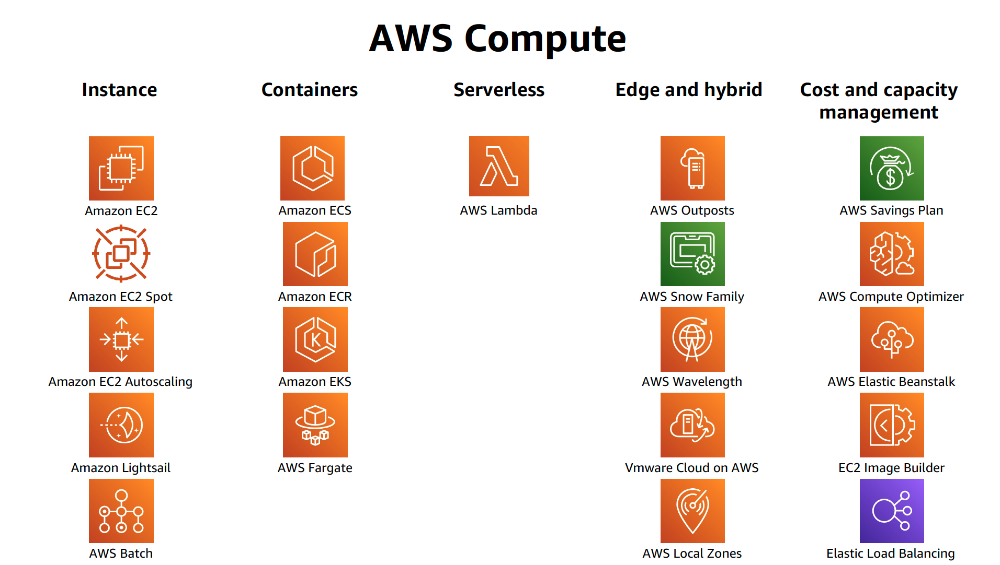

# Week 1 - AWS General Immersion Days

Basic modules consist of the following agenda:

Compute - Amazon EC2

Network - Amazon VPC

Security - AWS IAM

Monitoring - Amazon CloudWatch

Database - Amazon RDS

Storage - Amazon S3, Amazon Elastic File System

Provision - AWS CloudFormation

## Compute - Amazon EC2

