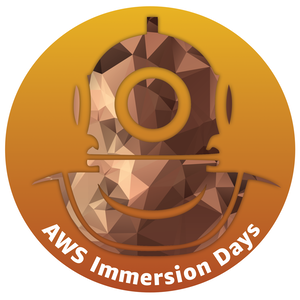

# Week 1 - AWS General Immersion Days

Basic modules consist of the following agenda:
1. Compute - Amazon EC2
2. Network - Amazon VPC
3. Security - AWS IAM
4. Monitoring - Amazon CloudWatch
5. Database - Amazon RDS
6. Storage - Amazon S3, Amazon Elastic File System
7. Provision - AWS CloudFormation
