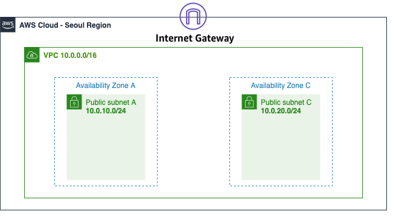

# Week 1 - AWS General Immersion Days

https://catalog.workshops.aws/general-immersionday/en-US


## 1. Key Pair Creation

Terraform script to create AWS EC2 Key Pair. Rememer to add the key to .gitignore file, otherwise private key will be exposed to public git repo

```
terraform {
  required_providers {
    aws = {
      source  = "hashicorp/aws"
      version = "~> 3.5.0"
    }
  }
}

# Configure the AWS Provider
provider "aws" {
  region = "us-east-1"
}

# Create a Key pair

resource "aws_key_pair" "WorkshopKeyPair" {
  key_name   = "WorkshopKeyPair"
  public_key = tls_private_key.rsa.public_key_openssh
}

# RSA key of size 4096 bits
resource "tls_private_key" "rsa" {
  algorithm = "RSA"
  rsa_bits  = 4096
}

# Create a local file
resource "local_file" "WorkshopKeyPair" {
  content  = tls_private_key.rsa.private_key_pem
  filename = "WorkshopKeyPair"
}
```
Key pair in AWS Console:


## 2. Web Tier EC2 Linux

main.tf - create various resources (provider and web EC2 instance with userdata)

```
terraform {
  required_providers {
    aws = {
      source  = "hashicorp/aws"
      version = "~> 3.0"
    }
  }
}

# Configure the AWS Provider
provider "aws" {
  region  = var.region
  profile = var.profile_name
}

# Get latest Amazon Linux 2 AMI
data "aws_ami" "amazon-linux-2" {
  most_recent = true
  owners      = ["amazon"]
  filter {
    name   = "name"
    values = ["amzn2-ami-hvm*"]
  }
}

# Create the Linux EC2 Web server
resource "aws_instance" "web" {
  ami             = data.aws_ami.amazon-linux-2.id
  instance_type   = var.instance_type
  key_name        = var.instance_key
  subnet_id       = aws_subnet.public_subnet.id
  security_groups = [aws_security_group.sg.id]

  user_data = <<-EOF
  #!/bin/bash
  yum update -y
  yum install -y httpd.x86_64
  systemctl start httpd.service
  systemctl enable httpd.service
  instanceId=$(curl http://169.254.169.254/latest/meta-data/instance-id)
   echo “AWS Linux VM Deployed with Terraform with instance id $instanceId” > /var/www/html/index.html
  EOF

  tags = {
    Name = "web_instance"
  }

  volume_tags = {
    Name = "web_instance"
  }
}
```
network.tf - Create VPC (VPC, internet gateway, subnet, route table)

```
# Create the VPC
resource "aws_vpc" "app_vpc" {
  cidr_block = var.vpc_cidr

  tags = {
    Name = "app-vpc"
  }
}

# Create the internet gateway
resource "aws_internet_gateway" "igw" {
  vpc_id = aws_vpc.app_vpc.id

  tags = {
    Name = "vpc_igw"
  }
}

# Create the public subnet
resource "aws_subnet" "public_subnet" {
  vpc_id                  = aws_vpc.app_vpc.id
  cidr_block              = var.public_subnet_cidr
  map_public_ip_on_launch = true
  availability_zone       = "us-east-1a"

  tags = {
    Name = "public-subnet"
  }
}

# Create the route table
resource "aws_route_table" "public_rt" {
  vpc_id = aws_vpc.app_vpc.id

  route {
    cidr_block = "0.0.0.0/0"
    gateway_id = aws_internet_gateway.igw.id
  }

  tags = {
    Name = "public_rt"
  }
}

# Assign the public route table to the public subnet
resource "aws_route_table_association" "public_rt_asso" {
  subnet_id      = aws_subnet.public_subnet.id
  route_table_id = aws_route_table.public_rt.id
}
```

sg.tf - create security group with ingress, egress rules

```
# Create the security group
resource "aws_security_group" "sg" {
  name        = "allow_ssh_http"
  description = "Allow ssh http inbound traffic"
  vpc_id      = aws_vpc.app_vpc.id

  ingress {
    description      = "SSH from VPC"
    from_port        = 22
    to_port          = 22
    protocol         = "tcp"
    cidr_blocks      = ["0.0.0.0/0"]
    ipv6_cidr_blocks = ["::/0"]
  }

  ingress {
    description      = "HTTP from VPC"
    from_port        = 80
    to_port          = 80
    protocol         = "tcp"
    cidr_blocks      = ["0.0.0.0/0"]
    ipv6_cidr_blocks = ["::/0"]
  }

  egress {
    from_port        = 0
    to_port          = 0
    protocol         = "-1"
    cidr_blocks      = ["0.0.0.0/0"]
    ipv6_cidr_blocks = ["::/0"]
  }

  tags = {
    Name = "allow_ssh_http"
  }
}
```

variables.tf
```
tervariable "region" {
  default = "us-east-1"
}
variable "instance_type" {
  default = "t2.micro"
}
variable "profile_name" {
  default = "default"
}
variable "instance_key" {
  default = "WorkshopKeyPair"
}
variable "vpc_cidr" {
  default = "178.0.0.0/16"
}
variable "public_subnet_cidr" {
  default = "178.0.10.0/24"
}
```

Terraform apply output:
```
Plan: 7 to add, 0 to change, 0 to destroy.

Changes to Outputs:
  + web_instance_id = (known after apply)
  + web_instance_ip = (known after apply)
aws_vpc.app_vpc: Creating...
aws_vpc.app_vpc: Still creating... [10s elapsed]
aws_vpc.app_vpc: Creation complete after 13s [id=vpc-0a73436b4fd4778af]
aws_internet_gateway.igw: Creating...
aws_subnet.public_subnet: Creating...
aws_security_group.sg: Creating...
aws_subnet.public_subnet: Creation complete after 5s [id=subnet-0c1590bd8528b6594]
aws_internet_gateway.igw: Creation complete after 6s [id=igw-063dbcfdd22dab1b8]
aws_route_table.public_rt: Creating...
aws_security_group.sg: Still creating... [10s elapsed]
aws_security_group.sg: Creation complete after 10s [id=sg-0ddcfe1f981f66733]
aws_instance.web: Creating...
aws_route_table.public_rt: Creation complete after 5s [id=rtb-03cad53d564069fe8]
aws_route_table_association.public_rt_asso: Creating...
aws_route_table_association.public_rt_asso: Creation complete after 2s [id=rtbassoc-05d129e8c110febe8]
aws_instance.web: Still creating... [10s elapsed]
aws_instance.web: Still creating... [20s elapsed]
aws_instance.web: Still creating... [30s elapsed]
aws_instance.web: Still creating... [40s elapsed]
aws_instance.web: Creation complete after 49s [id=i-04e12b8b6ade18b61]

Apply complete! Resources: 7 added, 0 changed, 0 destroyed.

Outputs:

web_instance_id = "i-04e12b8b6ade18b61"
web_instance_ip = "44.202.80.228"
```

Running website:


Terraform Destroy output:

```
Plan: 0 to add, 0 to change, 7 to destroy.

Changes to Outputs:
  - web_instance_id = "i-04e12b8b6ade18b61" -> null
  - web_instance_ip = "44.202.80.228" -> null
aws_route_table_association.public_rt_asso: Destroying... [id=rtbassoc-05d129e8c110febe8]
aws_instance.web: Destroying... [id=i-04e12b8b6ade18b61]
aws_route_table_association.public_rt_asso: Destruction complete after 1s
aws_route_table.public_rt: Destroying... [id=rtb-03cad53d564069fe8]
aws_route_table.public_rt: Destruction complete after 3s
aws_internet_gateway.igw: Destroying... [id=igw-063dbcfdd22dab1b8]
aws_instance.web: Still destroying... [id=i-04e12b8b6ade18b61, 10s elapsed]
aws_internet_gateway.igw: Still destroying... [id=igw-063dbcfdd22dab1b8, 10s elapsed]
aws_instance.web: Still destroying... [id=i-04e12b8b6ade18b61, 20s elapsed]
aws_internet_gateway.igw: Still destroying... [id=igw-063dbcfdd22dab1b8, 20s elapsed]
aws_instance.web: Still destroying... [id=i-04e12b8b6ade18b61, 30s elapsed]
aws_internet_gateway.igw: Destruction complete after 25s
aws_instance.web: Destruction complete after 35s
aws_subnet.public_subnet: Destroying... [id=subnet-0c1590bd8528b6594]
aws_security_group.sg: Destroying... [id=sg-0ddcfe1f981f66733]
aws_security_group.sg: Destruction complete after 2s
aws_subnet.public_subnet: Destruction complete after 2s
aws_vpc.app_vpc: Destroying... [id=vpc-0a73436b4fd4778af]
aws_vpc.app_vpc: Destruction complete after 2s

Destroy complete! Resources: 7 destroyed.
```

## 3. Web Tier EC2 Windows Server 2019
main.tf - create various resources (Provider and web EC2 instance with userdata)
```
terraform {
  required_providers {
    aws = {
      source  = "hashicorp/aws"
      version = "~> 3.0"
    }
  }
}

# Configure the AWS Provider
provider "aws" {
  region  = var.region
  profile = var.profile_name
}

# Get latest Amazon Windows Server 2019 Ami
data "aws_ami" "windows-2019" {
  most_recent = true
  owners      = ["amazon"]
  filter {
    name   = "name"
    values = ["Windows_Server-2019-English-Full-Base*"]
  }
}

# Create the Windows server 2019 Web Server
resource "aws_instance" "web" {
  ami             = data.aws_ami.windows-2019.id
  instance_type   = var.instance_type
  key_name        = var.instance_key
  subnet_id       = aws_subnet.public_subnet.id
  security_groups = [aws_security_group.sg.id]
  user_data       = file("userdata.tpl")


  tags = {
    Name = "web_instance"
  }

  volume_tags = {
    Name = "web_instance"
  }
}
```
network.tf - Create VPC (VPC, internet gateway, subnet, route table)
```
# Create the VPC
resource "aws_vpc" "app_vpc" {
  cidr_block = var.vpc_cidr

  tags = {
    Name = "app-vpc"
  }
}

# Create the internet gateway
resource "aws_internet_gateway" "igw" {
  vpc_id = aws_vpc.app_vpc.id

  tags = {
    Name = "vpc_igw"
  }
}

# Create the public subnet
resource "aws_subnet" "public_subnet" {
  vpc_id                  = aws_vpc.app_vpc.id
  cidr_block              = var.public_subnet_cidr
  map_public_ip_on_launch = true
  availability_zone       = "us-east-1a"

  tags = {
    Name = "public-subnet"
  }
}

# Create the route table
resource "aws_route_table" "public_rt" {
  vpc_id = aws_vpc.app_vpc.id

  route {
    cidr_block = "0.0.0.0/0"
    gateway_id = aws_internet_gateway.igw.id
  }

  tags = {
    Name = "public_rt"
  }
}

# Assign the public route table to the public subnet
resource "aws_route_table_association" "public_rt_asso" {
  subnet_id      = aws_subnet.public_subnet.id
  route_table_id = aws_route_table.public_rt.id
}
```
sg.tf - create security group with ingress, egress rules

```
# Create the security group
resource "aws_security_group" "sg" {
  name        = "allow_ssh_http"
  description = "Allow ssh http inbound traffic"
  vpc_id      = aws_vpc.app_vpc.id

  ingress {
    description      = "SSH from VPC"
    from_port        = 22
    to_port          = 22
    protocol         = "tcp"
    cidr_blocks      = ["0.0.0.0/0"]
    ipv6_cidr_blocks = ["::/0"]
  }

  ingress {
    description      = "HTTP from VPC"
    from_port        = 80
    to_port          = 80
    protocol         = "tcp"
    cidr_blocks      = ["0.0.0.0/0"]
    ipv6_cidr_blocks = ["::/0"]
  }

  egress {
    from_port        = 0
    to_port          = 0
    protocol         = "-1"
    cidr_blocks      = ["0.0.0.0/0"]
    ipv6_cidr_blocks = ["::/0"]
  }

  tags = {
    Name = "allow_ssh_http"
  }
}
```
userdata.tpl (userdata script in powershell)
```
<powershell>
Install-WindowsFeature -name Web-Server -IncludeManagementTools
$instanceId = Get-EC2InstanceMetadata -Path '/instance-id'
$id = (Invoke-WebRequest -Uri  http://169.254.169.254/latest/meta-data/instance-id -UseBasicParsing).content
New-Item -Path C:\inetpub\wwwroot\index.html -ItemType File -Value "AWS Windows VM Deployed with Terraform with instance id $instanceId : $id" -Force
</powershell>
```
output.tf
```
output "web_instance_ip" {
  value = aws_instance.web.public_ip
}

output "web_instance_id" {
  value = aws_instance.web.id
}
```

Terraform apply output:
```
Plan: 7 to add, 0 to change, 0 to destroy.

Changes to Outputs:
  + web_instance_id = (known after apply)
  + web_instance_ip = (known after apply)
aws_vpc.app_vpc: Creating...
aws_vpc.app_vpc: Still creating... [10s elapsed]
aws_vpc.app_vpc: Creation complete after 17s [id=vpc-04c04866cb32d6e2e]
aws_internet_gateway.igw: Creating...
aws_subnet.public_subnet: Creating...
aws_security_group.sg: Creating...
aws_internet_gateway.igw: Creation complete after 7s [id=igw-0329071a185c6afff]
aws_route_table.public_rt: Creating...
aws_subnet.public_subnet: Still creating... [10s elapsed]
aws_security_group.sg: Still creating... [10s elapsed]
aws_route_table.public_rt: Still creating... [10s elapsed]
aws_route_table.public_rt: Creation complete after 12s [id=rtb-086e66465adb40304]
aws_subnet.public_subnet: Creation complete after 20s [id=subnet-0cc92776d900331a0]
aws_route_table_association.public_rt_asso: Creating...
aws_security_group.sg: Still creating... [20s elapsed]
aws_security_group.sg: Creation complete after 22s [id=sg-048337eda0772a221]
aws_instance.web: Creating...
aws_route_table_association.public_rt_asso: Creation complete after 4s [id=rtbassoc-0288a8645618b7abd]
aws_instance.web: Still creating... [10s elapsed]
aws_instance.web: Still creating... [20s elapsed]
aws_instance.web: Still creating... [30s elapsed]
aws_instance.web: Still creating... [40s elapsed]
aws_instance.web: Still creating... [50s elapsed]
aws_instance.web: Still creating... [1m0s elapsed]
aws_instance.web: Still creating... [1m10s elapsed]
aws_instance.web: Still creating... [1m20s elapsed]
aws_instance.web: Still creating... [1m30s elapsed]
aws_instance.web: Still creating... [1m40s elapsed]
aws_instance.web: Still creating... [1m50s elapsed]
aws_instance.web: Still creating... [2m0s elapsed]
aws_instance.web: Still creating... [2m10s elapsed]
aws_instance.web: Creation complete after 2m17s [id=i-046e5e98f23f63202]

Apply complete! Resources: 7 added, 0 changed, 0 destroyed.

Outputs:

web_instance_id = "i-046e5e98f23f63202"
web_instance_ip = "44.204.58.224"
```

Running Website:
It takes some time for windows website to run


Terraform Destroy output:

```
Plan: 0 to add, 0 to change, 7 to destroy.

Changes to Outputs:
  - web_instance_id = "i-046e5e98f23f63202" -> null
  - web_instance_ip = "44.204.58.224" -> null
aws_route_table_association.public_rt_asso: Destroying... [id=rtbassoc-0288a8645618b7abd]
aws_instance.web: Destroying... [id=i-046e5e98f23f63202]
aws_route_table_association.public_rt_asso: Destruction complete after 4s
aws_route_table.public_rt: Destroying... [id=rtb-086e66465adb40304]
aws_instance.web: Still destroying... [id=i-046e5e98f23f63202, 10s elapsed]
aws_route_table.public_rt: Destruction complete after 6s
aws_internet_gateway.igw: Destroying... [id=igw-0329071a185c6afff]
aws_instance.web: Still destroying... [id=i-046e5e98f23f63202, 20s elapsed]
aws_internet_gateway.igw: Still destroying... [id=igw-0329071a185c6afff, 10s elapsed]
aws_instance.web: Still destroying... [id=i-046e5e98f23f63202, 30s elapsed]
aws_internet_gateway.igw: Still destroying... [id=igw-0329071a185c6afff, 20s elapsed]
aws_instance.web: Still destroying... [id=i-046e5e98f23f63202, 40s elapsed]
aws_internet_gateway.igw: Still destroying... [id=igw-0329071a185c6afff, 30s elapsed]
aws_instance.web: Still destroying... [id=i-046e5e98f23f63202, 50s elapsed]
aws_internet_gateway.igw: Still destroying... [id=igw-0329071a185c6afff, 40s elapsed]
aws_instance.web: Destruction complete after 54s
aws_subnet.public_subnet: Destroying... [id=subnet-0cc92776d900331a0]
aws_security_group.sg: Destroying... [id=sg-048337eda0772a221]
aws_internet_gateway.igw: Destruction complete after 44s
aws_subnet.public_subnet: Destruction complete after 4s
aws_security_group.sg: Destruction complete after 5s
aws_vpc.app_vpc: Destroying... [id=vpc-04c04866cb32d6e2e]
aws_vpc.app_vpc: Destruction complete after 3s

Destroy complete! Resources: 7 destroyed.
```


## 4. Auto Scaling Group

1. Create Custom AMI for auto scaling group from the YAML file provided in workshop

https://catalog.workshops.aws/general-immersionday/en-US/basic-modules/10-ec2/ec2-auto-scaling/ec2-auto-scaling/1-ec2-as

Create stack from yaml provided:


Submit the cloudformation template:


Running website:


Create AMI from running instance:


Create Security Group:


Auto Scaling Group Diagram:


2. variables.tf - variables for azs, public subnet ciders

```
variable "region" {
  default = "us-east-1"
}
variable "instance_type" {
  default = "t2.micro"
}
variable "profile_name" {
  default = "default"
}
variable "instance_key" {
  default = "WorkshopKeyPair"
}
variable "vpc_cidr" {
  default = "10.0.0.0/16"
}

# VPC Public Subnets
variable "public_subnet_cidrs" {
  description = "VPC Public Subnets"
  type        = list(string)
  default     = ["10.0.101.0/24", "10.0.102.0/24", "10.0.103.0/24", "10.0.104.0/24"]
}

/*
# VPC Private Subnets
variable "private_subnet_cidrs" {
  description = "VPC Private Subnets"
  type        = list(string)
  default     = ["10.0.1.0/24", "10.0.2.0/24", "10.0.3.0/24", "10.0.4.0/24"]
}
*/
variable "project_name" {
  default = "CT"
}

variable "azs" {
  type        = list(string)
  description = "Availability Zones"
  default     = ["us-east-1a", "us-east-1b", "us-east-1c", "us-east-1d"]
}
```
3. network.tf - Create VPC with 4 public subnet, attach internet gateway

```
# Create the VPC
resource "aws_vpc" "app_vpc" {
  cidr_block = var.vpc_cidr

  tags = {
    Name = "${var.project_name}-VPC"
  }
}

#create public subnets per zone
resource "aws_subnet" "public_subnets" {
  count             = length(var.public_subnet_cidrs)
  vpc_id            = aws_vpc.app_vpc.id
  cidr_block        = element(var.public_subnet_cidrs, count.index)
  availability_zone = element(var.azs, count.index)

  tags = {
    Name = "Public Subnet ${count.index + 1}"
  }
}

# Create the internet gateway
resource "aws_internet_gateway" "igw" {
  vpc_id = aws_vpc.app_vpc.id

  tags = {
    Name = "${var.project_name}-igw"
  }
}

# Create the route table
resource "aws_route_table" "public_rt" {
  vpc_id = aws_vpc.app_vpc.id

  route {
    cidr_block = "0.0.0.0/0"
    gateway_id = aws_internet_gateway.igw.id
  }

  tags = {
    Name = "public_rt"
  }
}

# Create route table assosiation with all public subnets
resource "aws_route_table_association" "public_subnet_asso" {
  count          = length(var.public_subnet_cidrs)
  subnet_id      = element(aws_subnet.public_subnets[*].id, count.index)
  route_table_id = aws_route_table.public_rt.id
}
```

4. Create application load balancer with target group and listener

```
# create application load balancer
resource "aws_lb" "aws-application_load_balancer" {
  name                       = "${var.project_name}-alb"
  internal                   = false
  load_balancer_type         = "application"
  security_groups            = [aws_security_group.aws-sg-load-balancer.id]
  subnets                    = [for s in aws_subnet.public_subnets : s.id]
  enable_deletion_protection = false

  tags = {
    Name = "${var.project_name}-alb"
  }
}

# create target group
resource "aws_lb_target_group" "alb_target_group" {
  name        = "${var.project_name}-tg"
  target_type = "instance"
  port        = 80
  protocol    = "HTTP"
  vpc_id      = aws_vpc.app_vpc.id

  health_check {
    enabled             = true
    interval            = 300
    path                = "/"
    timeout             = 60
    matcher             = 200
    healthy_threshold   = 5
    unhealthy_threshold = 5
  }

  lifecycle {
    create_before_destroy = true
  }
}

# create a listener on port 80 with redirect action
resource "aws_lb_listener" "alb_http_listener" {
  load_balancer_arn = aws_lb.aws-application_load_balancer.id
  port              = 80
  protocol          = "HTTP"

  default_action {
    type             = "forward"
    target_group_arn = aws_lb_target_group.alb_target_group.id

  }
}
```


5. Create ASG launch template with auto scaling group and policy


```
# Get the AMI created ealier
data "aws_ami" "amazon-linux-ami" {
  most_recent = true
  owners      = ["self"]
  filter {
    name   = "name"
    values = ["CT_Auto_Scaling_Webhost"]
  }
}

# Create Launch Template Resource
resource "aws_launch_template" "aws-launch-template" {
  name                   = "${var.project_name}-scaling-template"
  image_id               = data.aws_ami.amazon-linux-ami.id
  instance_type          = var.instance_type
  key_name               = var.instance_key
  vpc_security_group_ids = [aws_security_group.sg.id]
  update_default_version = true
  tag_specifications {
    resource_type = "instance"
    tags = {
      Name = "aws-webserver-demo"
    }
  }
  monitoring {
    enabled = true
  }

  tag_specifications {
    resource_type = "instance"
    tags = {
      Name = "myasg"
    }
  }
}

# Create auto scaling group
resource "aws_autoscaling_group" "aws-autoscaling-group" {
  name                = "${var.project_name}-ASG-Group"
  vpc_zone_identifier = [for s in aws_subnet.public_subnets : s.id]
  desired_capacity    = 1
  max_size            = 4
  min_size            = 1

  launch_template {
    id      = aws_launch_template.aws-launch-template.id
    version = aws_launch_template.aws-launch-template.latest_version
  }
}

# Create target tracking scaling policy for average CPU utilization
resource "aws_autoscaling_policy" "avg_cpu_scaling_policy" {
  name                   = "avg_cpu_scaling_policy"
  policy_type            = "TargetTrackingScaling"
  autoscaling_group_name = aws_autoscaling_group.aws-autoscaling-group.name
  target_tracking_configuration {
    predefined_metric_specification {
      predefined_metric_type = "ASGAverageCPUUtilization"
    }
    target_value = 25.0
  }
  estimated_instance_warmup = 180
}

# attach auto scaling group to Application Load Balancer ALB
resource "aws_autoscaling_attachment" "asg_attachment_alb" {
  autoscaling_group_name = aws_autoscaling_group.aws-autoscaling-group.id
  lb_target_group_arn    = aws_lb_target_group.alb_target_group.arn
}

```

Terraform Apply output:

```
Plan: 21 to add, 0 to change, 0 to destroy.

Changes to Outputs:
  + alb_target_group_arn           = (known after apply)
  + autoscaling_group_arn          = (known after apply)
  + autoscaling_group_id           = (known after apply)
  + autoscaling_group_name         = "CT-ASG-Group"
  + launch_template_id             = (known after apply)
  + launch_template_latest_version = (known after apply)
aws_vpc.app_vpc: Creating...
aws_vpc.app_vpc: Creation complete after 5s [id=vpc-02b906e7043f3d8e6]
aws_internet_gateway.igw: Creating...
aws_subnet.public_subnets[0]: Creating...
aws_subnet.public_subnets[2]: Creating...
aws_subnet.public_subnets[1]: Creating...
aws_subnet.public_subnets[3]: Creating...
aws_security_group.sg: Creating...
aws_lb_target_group.alb_target_group: Creating...
aws_subnet.public_subnets[2]: Creation complete after 2s [id=subnet-0541a9c0a045c7363]
aws_subnet.public_subnets[0]: Creation complete after 2s [id=subnet-028aee147164dc72d]
aws_subnet.public_subnets[1]: Creation complete after 2s [id=subnet-09ebd094c0505109e]
aws_subnet.public_subnets[3]: Creation complete after 2s [id=subnet-0a7b17965f98308b6]
aws_internet_gateway.igw: Creation complete after 3s [id=igw-06e2271835e6f4da0]
aws_route_table.public_rt: Creating...
aws_lb_target_group.alb_target_group: Creation complete after 4s [id=arn:aws:elasticloadbalancing:us-east-1:197317184204:targetgroup/CT-tg/ea3170d1f5d7a0cb]
aws_security_group.sg: Creation complete after 5s [id=sg-06e64d1f78fa99fbb]
aws_security_group.aws-sg-load-balancer: Creating...
aws_launch_template.aws-launch-template: Creating...
aws_route_table.public_rt: Creation complete after 2s [id=rtb-075b7945b1debdf87]
aws_route_table_association.public_subnet_asso[2]: Creating...
aws_route_table_association.public_subnet_asso[0]: Creating...
aws_route_table_association.public_subnet_asso[3]: Creating...
aws_route_table_association.public_subnet_asso[1]: Creating...
aws_launch_template.aws-launch-template: Creation complete after 1s [id=lt-01a2a11483417456c]
aws_autoscaling_group.aws-autoscaling-group: Creating...
aws_route_table_association.public_subnet_asso[1]: Creation complete after 1s [id=rtbassoc-002e1ee56cf799d71]
aws_route_table_association.public_subnet_asso[2]: Creation complete after 1s [id=rtbassoc-03d19759add215b30]
aws_route_table_association.public_subnet_asso[0]: Creation complete after 1s [id=rtbassoc-017a953531b315031]
aws_route_table_association.public_subnet_asso[3]: Creation complete after 2s [id=rtbassoc-04a392ea7cb2bb025]
aws_security_group.aws-sg-load-balancer: Creation complete after 5s [id=sg-056f59c0d068ff490]
aws_security_group_rule.ASG-sg-to-alb-sg-ingress: Creating...
aws_lb.aws-application_load_balancer: Creating...
aws_security_group_rule.ASG-sg-to-alb-sg-ingress: Creation complete after 1s [id=sgrule-3273163239]
aws_autoscaling_group.aws-autoscaling-group: Still creating... [10s elapsed]
aws_lb.aws-application_load_balancer: Still creating... [10s elapsed]
aws_autoscaling_group.aws-autoscaling-group: Still creating... [20s elapsed]
aws_lb.aws-application_load_balancer: Still creating... [20s elapsed]
aws_autoscaling_group.aws-autoscaling-group: Still creating... [30s elapsed]
aws_lb.aws-application_load_balancer: Still creating... [30s elapsed]
aws_autoscaling_group.aws-autoscaling-group: Still creating... [40s elapsed]
aws_lb.aws-application_load_balancer: Still creating... [40s elapsed]
aws_autoscaling_group.aws-autoscaling-group: Creation complete after 46s [id=CT-ASG-Group]
aws_autoscaling_attachment.asg_attachment_alb: Creating...
aws_autoscaling_policy.avg_cpu_scaling_policy: Creating...
aws_autoscaling_attachment.asg_attachment_alb: Creation complete after 2s [id=CT-ASG-Group-20231016100015880300000002]
aws_autoscaling_policy.avg_cpu_scaling_policy: Creation complete after 2s [id=avg_cpu_scaling_policy]
aws_lb.aws-application_load_balancer: Still creating... [50s elapsed]
aws_lb.aws-application_load_balancer: Still creating... [1m0s elapsed]
aws_lb.aws-application_load_balancer: Still creating... [1m10s elapsed]
aws_lb.aws-application_load_balancer: Still creating... [1m20s elapsed]
aws_lb.aws-application_load_balancer: Still creating... [1m30s elapsed]
aws_lb.aws-application_load_balancer: Still creating... [1m40s elapsed]
aws_lb.aws-application_load_balancer: Still creating... [1m50s elapsed]
aws_lb.aws-application_load_balancer: Still creating... [2m10s elapsed]
aws_lb.aws-application_load_balancer: Still creating... [2m20s elapsed]
aws_lb.aws-application_load_balancer: Creation complete after 2m28s [id=arn:aws:elasticloadbalancing:us-east-1:197317184204:loadbalancer/app/CT-alb/86487cfbd838c4c4]       
aws_lb_listener.alb_http_listener: Creating...
aws_lb_listener.alb_http_listener: Creation complete after 1s [id=arn:aws:elasticloadbalancing:us-east-1:197317184204:listener/app/CT-alb/86487cfbd838c4c4/8d91a9de371f1fa6]

Apply complete! Resources: 21 added, 0 changed, 0 destroyed.

Outputs:

alb_target_group_arn = "arn:aws:elasticloadbalancing:us-east-1:197317184204:targetgroup/CT-tg/ea3170d1f5d7a0cb"
autoscaling_group_arn = "arn:aws:autoscaling:us-east-1:197317184204:autoScalingGroup:ac194ac6-81c0-4911-a369-454cd27a02d4:autoScalingGroupName/CT-ASG-Group"
autoscaling_group_id = "CT-ASG-Group"
autoscaling_group_name = "CT-ASG-Group"
launch_template_id = "lt-01a2a11483417456c"
launch_template_latest_version = 1
```

Running on us-east-1c


After stressing the CPU


Autoscalling Worked!!!


Terraform Destroy Output:

```
Plan: 0 to add, 0 to change, 21 to destroy.

Changes to Outputs:
  - alb_target_group_arn           = "arn:aws:elasticloadbalancing:us-east-1:197317184204:targetgroup/CT-tg/ea3170d1f5d7a0cb" -> null
  - autoscaling_group_arn          = "arn:aws:autoscaling:us-east-1:197317184204:autoScalingGroup:ac194ac6-81c0-4911-a369-454cd27a02d4:autoScalingGroupName/CT-ASG-Group" -> null
  - autoscaling_group_id           = "CT-ASG-Group" -> null
  - autoscaling_group_name         = "CT-ASG-Group" -> null
  - launch_template_id             = "lt-01a2a11483417456c" -> null
  - launch_template_latest_version = 1 -> null
aws_autoscaling_attachment.asg_attachment_alb: Destroying... [id=CT-ASG-Group-20231016100015880300000002]
aws_route_table_association.public_subnet_asso[2]: Destroying... [id=rtbassoc-03d19759add215b30]
aws_route_table_association.public_subnet_asso[0]: Destroying... [id=rtbassoc-017a953531b315031]
aws_route_table_association.public_subnet_asso[3]: Destroying... [id=rtbassoc-04a392ea7cb2bb025]
aws_route_table_association.public_subnet_asso[1]: Destroying... [id=rtbassoc-002e1ee56cf799d71]
aws_security_group_rule.ASG-sg-to-alb-sg-ingress: Destroying... [id=sgrule-3273163239]
aws_lb_listener.alb_http_listener: Destroying... [id=arn:aws:elasticloadbalancing:us-east-1:197317184204:listener/app/CT-alb/86487cfbd838c4c4/8d91a9de371f1fa6]
aws_autoscaling_policy.avg_cpu_scaling_policy: Destroying... [id=avg_cpu_scaling_policy]
aws_autoscaling_attachment.asg_attachment_alb: Destruction complete after 2s
aws_autoscaling_policy.avg_cpu_scaling_policy: Destruction complete after 2s
aws_autoscaling_group.aws-autoscaling-group: Destroying... [id=CT-ASG-Group]
aws_route_table_association.public_subnet_asso[3]: Destruction complete after 2s
aws_route_table_association.public_subnet_asso[2]: Destruction complete after 2s
aws_route_table_association.public_subnet_asso[1]: Destruction complete after 2s
aws_route_table_association.public_subnet_asso[0]: Destruction complete after 2s
aws_lb_listener.alb_http_listener: Destruction complete after 2s
aws_security_group_rule.ASG-sg-to-alb-sg-ingress: Destruction complete after 2s
aws_route_table.public_rt: Destroying... [id=rtb-075b7945b1debdf87]
aws_lb_target_group.alb_target_group: Destroying... [id=arn:aws:elasticloadbalancing:us-east-1:197317184204:targetgroup/CT-tg/ea3170d1f5d7a0cb]
aws_lb.aws-application_load_balancer: Destroying... [id=arn:aws:elasticloadbalancing:us-east-1:197317184204:loadbalancer/app/CT-alb/86487cfbd838c4c4]
aws_lb_target_group.alb_target_group: Destruction complete after 1s
aws_route_table.public_rt: Destruction complete after 2s
aws_internet_gateway.igw: Destroying... [id=igw-06e2271835e6f4da0]
aws_autoscaling_group.aws-autoscaling-group: Still destroying... [id=CT-ASG-Group, 10s elapsed]
aws_lb.aws-application_load_balancer: Still destroying... [id=arn:aws:elasticloadbalancing:us-east-1:...adbalancer/app/CT-alb/86487cfbd838c4c4, 10s elapsed]
aws_lb.aws-application_load_balancer: Destruction complete after 10s
aws_security_group.aws-sg-load-balancer: Destroying... [id=sg-056f59c0d068ff490]
aws_internet_gateway.igw: Still destroying... [id=igw-06e2271835e6f4da0, 10s elapsed]
aws_autoscaling_group.aws-autoscaling-group: Still destroying... [id=CT-ASG-Group, 20s elapsed]
aws_security_group.aws-sg-load-balancer: Still destroying... [id=sg-056f59c0d068ff490, 10s elapsed]
aws_internet_gateway.igw: Still destroying... [id=igw-06e2271835e6f4da0, 20s elapsed]
aws_autoscaling_group.aws-autoscaling-group: Still destroying... [id=CT-ASG-Group, 30s elapsed]
aws_security_group.aws-sg-load-balancer: Still destroying... [id=sg-056f59c0d068ff490, 20s elapsed]
aws_internet_gateway.igw: Still destroying... [id=igw-06e2271835e6f4da0, 30s elapsed]
aws_autoscaling_group.aws-autoscaling-group: Still destroying... [id=CT-ASG-Group, 40s elapsed]
aws_security_group.aws-sg-load-balancer: Still destroying... [id=sg-056f59c0d068ff490, 30s elapsed]
aws_internet_gateway.igw: Still destroying... [id=igw-06e2271835e6f4da0, 40s elapsed]
aws_autoscaling_group.aws-autoscaling-group: Still destroying... [id=CT-ASG-Group, 50s elapsed]
aws_security_group.aws-sg-load-balancer: Still destroying... [id=sg-056f59c0d068ff490, 40s elapsed]
aws_internet_gateway.igw: Still destroying... [id=igw-06e2271835e6f4da0, 50s elapsed]
aws_autoscaling_group.aws-autoscaling-group: Destruction complete after 56s
aws_subnet.public_subnets[3]: Destroying... [id=subnet-0a7b17965f98308b6]
aws_subnet.public_subnets[0]: Destroying... [id=subnet-028aee147164dc72d]
aws_subnet.public_subnets[1]: Destroying... [id=subnet-09ebd094c0505109e]
aws_subnet.public_subnets[2]: Destroying... [id=subnet-0541a9c0a045c7363]
aws_launch_template.aws-launch-template: Destroying... [id=lt-01a2a11483417456c]
aws_launch_template.aws-launch-template: Destruction complete after 2s
aws_security_group.aws-sg-load-balancer: Destruction complete after 47s
aws_security_group.sg: Destroying... [id=sg-06e64d1f78fa99fbb]
aws_internet_gateway.igw: Destruction complete after 57s
aws_subnet.public_subnets[0]: Destruction complete after 3s
aws_subnet.public_subnets[1]: Destruction complete after 3s
aws_subnet.public_subnets[2]: Destruction complete after 3s
aws_subnet.public_subnets[3]: Destruction complete after 3s
aws_security_group.sg: Destruction complete after 2s
aws_vpc.app_vpc: Destroying... [id=vpc-02b906e7043f3d8e6]
aws_vpc.app_vpc: Destruction complete after 2s

Destroy complete! Resources: 21 destroyed.
```


## 4. VPC



1. network.tf - create VPC, subnets, igw and route tables
```
# Create the VPC
resource "aws_vpc" "app_vpc" {
  cidr_block = var.vpc_cidr

  tags = {
    Name = "${var.project_name}-VPC"
  }
}

#create public subnets per zone
resource "aws_subnet" "public_subnets" {
  count             = length(var.public_subnet_cidrs)
  vpc_id            = aws_vpc.app_vpc.id
  cidr_block        = element(var.public_subnet_cidrs, count.index)
  availability_zone = element(var.azs, count.index)

  tags = {
    Name = "Public Subnet ${count.index + 1}"
  }
}

# Create the internet gateway
resource "aws_internet_gateway" "igw" {
  vpc_id = aws_vpc.app_vpc.id

  tags = {
    Name = "${var.project_name}-igw"
  }
}

# Create the route table
resource "aws_route_table" "public_rt" {
  vpc_id = aws_vpc.app_vpc.id

  route {
    cidr_block = "0.0.0.0/0"
    gateway_id = aws_internet_gateway.igw.id
  }

  tags = {
    Name = "public_rt"
  }
}

# Create route table assosiation with all public subnets
resource "aws_route_table_association" "public_subnet_asso" {
  count          = length(var.public_subnet_cidrs)
  subnet_id      = element(aws_subnet.public_subnets[*].id, count.index)
  route_table_id = aws_route_table.public_rt.id
}
```

2. sg.tf - Security group to allow TCP / HTTP Traffic in and out

```
# Create the security group
resource "aws_security_group" "sg" {
  name        = "allow_ssh_http"
  description = "Allow ssh http inbound traffic"
  vpc_id      = aws_vpc.app_vpc.id

  ingress {
    description      = "SSH from VPC"
    from_port        = 22
    to_port          = 22
    protocol         = "tcp"
    cidr_blocks      = ["0.0.0.0/0"]
    ipv6_cidr_blocks = ["::/0"]
  }

  ingress {
    description      = "HTTP from VPC"
    from_port        = 80
    to_port          = 80
    protocol         = "tcp"
    cidr_blocks      = ["0.0.0.0/0"]
    ipv6_cidr_blocks = ["::/0"]
  }

  egress {
    from_port        = 0
    to_port          = 0
    protocol         = "-1"
    cidr_blocks      = ["0.0.0.0/0"]
    ipv6_cidr_blocks = ["::/0"]
  }

  tags = {
    Name = "allow_ssh_http"
  }
}
```

Terraform apply output:
```
Plan: 8 to add, 0 to change, 0 to destroy.

Changes to Outputs:
  + vpc_id = (known after apply)
aws_vpc.app_vpc: Creating...
aws_vpc.app_vpc: Still creating... [10s elapsed]
aws_vpc.app_vpc: Creation complete after 12s [id=vpc-059d3456553be459a]
aws_internet_gateway.igw: Creating...
aws_subnet.public_subnets[0]: Creating...
aws_subnet.public_subnets[1]: Creating...
aws_security_group.sg: Creating...
aws_subnet.public_subnets[0]: Creation complete after 4s [id=subnet-05ecceebea4b2136b]
aws_subnet.public_subnets[1]: Creation complete after 4s [id=subnet-071e4349c02fbbc0d]
aws_internet_gateway.igw: Creation complete after 5s [id=igw-007b15c2ec3d3eda2]
aws_route_table.public_rt: Creating...
aws_security_group.sg: Still creating... [10s elapsed]
aws_route_table.public_rt: Creation complete after 7s [id=rtb-066e33db9b41a9268]
aws_route_table_association.public_subnet_asso[0]: Creating...
aws_route_table_association.public_subnet_asso[1]: Creating...
aws_security_group.sg: Creation complete after 13s [id=sg-0d0a95eaf56f6350c]
aws_route_table_association.public_subnet_asso[0]: Creation complete after 4s [id=rtbassoc-0a312f30e30f9319a]
aws_route_table_association.public_subnet_asso[1]: Creation complete after 4s [id=rtbassoc-0d9ce3dfd1bf287be]

Apply complete! Resources: 8 added, 0 changed, 0 destroyed.

Outputs:

vpc_id = "vpc-059d3456553be459a"
```

Terraform Destroy output:
```
Plan: 0 to add, 0 to change, 8 to destroy.

Changes to Outputs:
  - vpc_id = "vpc-059d3456553be459a" -> null
aws_route_table_association.public_subnet_asso[0]: Destroying... [id=rtbassoc-0a312f30e30f9319a]
aws_route_table_association.public_subnet_asso[1]: Destroying... [id=rtbassoc-0d9ce3dfd1bf287be]
aws_security_group.sg: Destroying... [id=sg-0d0a95eaf56f6350c]
aws_route_table_association.public_subnet_asso[1]: Destruction complete after 3s
aws_route_table_association.public_subnet_asso[0]: Destruction complete after 3s
aws_subnet.public_subnets[1]: Destroying... [id=subnet-071e4349c02fbbc0d]
aws_subnet.public_subnets[0]: Destroying... [id=subnet-05ecceebea4b2136b]
aws_route_table.public_rt: Destroying... [id=rtb-066e33db9b41a9268]
aws_security_group.sg: Destruction complete after 3s
aws_subnet.public_subnets[1]: Destruction complete after 2s
aws_subnet.public_subnets[0]: Destruction complete after 2s
aws_route_table.public_rt: Destruction complete after 3s
aws_internet_gateway.igw: Destroying... [id=igw-007b15c2ec3d3eda2]
aws_internet_gateway.igw: Destruction complete after 4s
aws_vpc.app_vpc: Destroying... [id=vpc-059d3456553be459a]
aws_vpc.app_vpc: Destruction complete after 1s

Destroy complete! Resources: 8 destroyed.
```

## 5. IAM
1. network.tf - create VPC and subnets

```
# Create the VPC
resource "aws_vpc" "app_vpc" {
  cidr_block = var.vpc_cidr

  tags = {
    Name = "${var.project_name}-VPC"
  }
}

#create public subnets per zone
resource "aws_subnet" "public_subnets" {
  count             = length(var.public_subnet_cidrs)
  vpc_id            = aws_vpc.app_vpc.id
  cidr_block        = element(var.public_subnet_cidrs, count.index)
  availability_zone = element(var.azs, count.index)

  tags = {
    Name = "Public Subnet ${count.index + 1}"
  }
}

# Create the internet gateway
resource "aws_internet_gateway" "igw" {
  vpc_id = aws_vpc.app_vpc.id

  tags = {
    Name = "${var.project_name}-igw"
  }
}

# Create the route table
resource "aws_route_table" "public_rt" {
  vpc_id = aws_vpc.app_vpc.id

  route {
    cidr_block = "0.0.0.0/0"
    gateway_id = aws_internet_gateway.igw.id
  }

  tags = {
    Name = "public_rt"
  }
}

# Create route table assosiation with all public subnets
resource "aws_route_table_association" "public_subnet_asso" {
  count          = length(var.public_subnet_cidrs)
  subnet_id      = element(aws_subnet.public_subnets[*].id, count.index)
  route_table_id = aws_route_table.public_rt.id
}
```

2. main.tf - create 2 EC2 instances (instance profile for prod_instance mentioned in iam.tf)
```
terraform {
  required_providers {
    aws = {
      source  = "hashicorp/aws"
      version = "~> 3.0"
    }
  }
}

# Configure the AWS Provider
provider "aws" {
  region  = var.region
  profile = var.profile_name
}


# Get latest Amazon Linux 2 AMI
data "aws_ami" "amazon-linux-2" {
  most_recent = true
  owners      = ["amazon"]
  filter {
    name   = "name"
    values = ["amzn2-ami-hvm*"]
  }
}

# Create the Linux EC2 Web server
resource "aws_instance" "prod-instance" {
  ami                         = data.aws_ami.amazon-linux-2.id
  instance_type               = var.instance_type
  key_name                    = var.instance_key
  subnet_id                   = aws_subnet.public_subnets[0].id
  security_groups             = [aws_security_group.sg.id]
  associate_public_ip_address = true

  # attach instance profile to EC2
  iam_instance_profile = aws_iam_instance_profile.ec2_instance_profile.name

  user_data = <<-EOF
  #!/bin/bash
  yum update -y
  yum install -y httpd.x86_64
  systemctl start httpd.service
  systemctl enable httpd.service
  instanceId=$(curl http://169.254.169.254/latest/meta-data/instance-id)
   echo “AWS Linux VM Deployed with Terraform with instance id $instanceId” > /var/www/html/index.html
  EOF

  tags = {
    Name = "prod-instance"
    Env  = "prod"
  }

  volume_tags = {
    Name = "prod-instance"
  }
}

resource "aws_instance" "dev-instance" {
  ami                         = data.aws_ami.amazon-linux-2.id
  instance_type               = var.instance_type
  key_name                    = var.instance_key
  subnet_id                   = aws_subnet.public_subnets[1].id
  security_groups             = [aws_security_group.sg.id]
  associate_public_ip_address = true

  user_data = <<-EOF
  #!/bin/bash
  yum update -y
  yum install -y httpd.x86_64
  systemctl start httpd.service
  systemctl enable httpd.service
  instanceId=$(curl http://169.254.169.254/latest/meta-data/instance-id)
   echo “AWS Linux VM Deployed with Terraform with instance id $instanceId” > /var/www/html/index.html
  EOF

  tags = {
    Name = "dev-instance"
    Env  = "dev"
  }

  volume_tags = {
    Name = "dev-instance"
  }
}

```


3. iam.tf (Create IAM group, policy, user and then s3 buckets and ec2 instance profile)


```
# Create a user group
resource "aws_iam_group" "dev-group" {
  name = "dev-group"
}
# Create IAM Policy for group
resource "aws_iam_policy" "DevPolicy" {
  name = "DevPolicy"

  policy = jsonencode({
    "Version" : "2012-10-17",
    "Statement" : [
      {
        "Effect" : "Allow",
        "Action" : "ec2:*",
        "Resource" : "*",
        "Condition" : {
          "StringEquals" : {
            "ec2:ResourceTag/Env" : "dev"
          }
        }
      },
      {
        "Effect" : "Allow",
        "Action" : "ec2:Describe*",
        "Resource" : "*"
      },
      {
        "Effect" : "Deny",
        "Action" : [
          "ec2:DeleteTags",
          "ec2:CreateTags"
        ],
        "Resource" : "*"
      }
    ]
    }
  )
}

resource "aws_iam_group_policy_attachment" "dev-attach" {
  group      = aws_iam_group.dev-group.name
  policy_arn = aws_iam_policy.DevPolicy.arn
}

# Create IAM User
resource "aws_iam_user" "dev-user" {
  name          = "dev-user"
  force_destroy = true
}

resource "aws_iam_group_membership" "devstream" {
  name  = aws_iam_user.dev-user.name
  users = [aws_iam_user.dev-user.name]
  group = aws_iam_group.dev-group.name
}


########

# Create First Bucket
resource "aws_s3_bucket" "chinmayto-s3" {
  bucket = "chinmayto-s3"
}

resource "aws_s3_bucket_object" "object1" {
  for_each = fileset("uploads/", "*")
  bucket   = aws_s3_bucket.chinmayto-s3.id
  key      = each.value
  source   = "uploads/${each.value}"
}

# Create Second Bucket

resource "aws_s3_bucket" "chinmayto-s3-other" {
  bucket = "chinmayto-s3-other"
}

resource "aws_s3_bucket_object" "object2" {
  for_each = fileset("uploads/", "*")
  bucket   = aws_s3_bucket.chinmayto-s3-other.id
  key      = each.value
  source   = "uploads/${each.value}"
}


# Create policy for role
resource "aws_iam_policy" "IAMBucketTestPolicy" {
  name = "IAMBucketTestPolicy"

  policy = jsonencode({
    "Version" : "2012-10-17",
    "Statement" : [
      {
        "Action" : ["s3:ListAllMyBuckets", "s3:GetBucketLocation"],
        "Effect" : "Allow",
        "Resource" : ["arn:aws:s3:::*"]
      },
      {
        "Effect" : "Allow",
        "Action" : [
          "s3:Get*",
          "s3:List*"
        ],
        "Resource" : [
          "arn:aws:s3:::chinmayto-s3/*",
          "arn:aws:s3:::chinmayto-s3"
        ]
      }
    ]
    }
  )
}


# Create a role that can be assumed by an Amazon EC2 instance
resource "aws_iam_role" "ec2_role" {
  name = "ec2_role"

  assume_role_policy = <<EOF
{
  "Version": "2012-10-17",
  "Statement": [
    {
      "Effect": "Allow",
      "Principal": {
        "Service": "ec2.amazonaws.com"
      },
      "Action": "sts:AssumeRole"
    }
  ]
}
EOF
}

# Attach the role to the policy
resource "aws_iam_role_policy_attachment" "example_attachment" {
  role       = aws_iam_role.ec2_role.name
  policy_arn = aws_iam_policy.IAMBucketTestPolicy.arn
}

# Create an instance profile
resource "aws_iam_instance_profile" "ec2_instance_profile" {
  name = "ec2_instance_profile"
  role = aws_iam_role.ec2_role.name
}
```

I'd like to create a aws_iam_user_login_profile resource without the need for PGP.

I understand the security risks, but for my use case I want to provision user login profiles in a sandbox environment using automated methods, which I dont want the overhead of using PGP.
I feel that the PGP approach should be recommended, but not mandated for use.

Technically you can still create a user (aws_iam_user) without a profile, but it won't have a password until someone manually enables login in the Console UI. When you create the user you probably want the force_destroy = true set otherwise terraform will refuse to delete the user later on if any changes are made by the user to their own account or a login password is enabled.

Here i manually set the password for the dev-user from the console and logged in.

Terraform apply output:
```
Plan: 25 to add, 0 to change, 0 to destroy.

Changes to Outputs:
  + vpc_id = (known after apply)
aws_iam_group.dev-group: Creating...
aws_iam_policy.DevPolicy: Creating...
aws_iam_user.dev-user: Creating...
aws_iam_role.ec2_role: Creating...
aws_iam_policy.IAMBucketTestPolicy: Creating...
aws_vpc.app_vpc: Creating...
aws_s3_bucket.chinmayto-s3: Creating...
aws_s3_bucket.chinmayto-s3-other: Creating...
aws_iam_group.dev-group: Creation complete after 2s [id=dev-group]
aws_iam_user.dev-user: Creation complete after 3s [id=dev-user]
aws_iam_group_membership.devstream: Creating...
aws_iam_policy.IAMBucketTestPolicy: Creation complete after 4s [id=arn:aws:iam::197317184204:policy/IAMBucketTestPolicy]
aws_iam_policy.DevPolicy: Creation complete after 4s [id=arn:aws:iam::197317184204:policy/DevPolicy]
aws_iam_group_policy_attachment.dev-attach: Creating...
aws_iam_group_membership.devstream: Creation complete after 2s [id=dev-user]
aws_iam_role.ec2_role: Creation complete after 5s [id=ec2_role]
aws_iam_role_policy_attachment.example_attachment: Creating...
aws_iam_instance_profile.ec2_instance_profile: Creating...
aws_iam_group_policy_attachment.dev-attach: Creation complete after 2s [id=dev-group-20231020053733902200000001]
aws_iam_role_policy_attachment.example_attachment: Creation complete after 2s [id=ec2_role-20231020053735190800000002]
aws_iam_instance_profile.ec2_instance_profile: Creation complete after 3s [id=ec2_instance_profile]
aws_vpc.app_vpc: Still creating... [10s elapsed]
aws_s3_bucket.chinmayto-s3-other: Still creating... [10s elapsed]
aws_s3_bucket.chinmayto-s3: Still creating... [10s elapsed]
aws_vpc.app_vpc: Creation complete after 11s [id=vpc-0242ad26d96798181]
aws_internet_gateway.igw: Creating...
aws_subnet.public_subnets[1]: Creating...
aws_subnet.public_subnets[0]: Creating...
aws_security_group.sg: Creating...
aws_subnet.public_subnets[1]: Creation complete after 4s [id=subnet-092952272f0d092c9]
aws_subnet.public_subnets[0]: Creation complete after 4s [id=subnet-022e967d79173e3ee]
aws_s3_bucket.chinmayto-s3: Creation complete after 16s [id=chinmayto-s3]
aws_internet_gateway.igw: Creation complete after 5s [id=igw-0c389d257dfeb5b88]
aws_s3_bucket_object.object1["text2.txt"]: Creating...
aws_route_table.public_rt: Creating...
aws_s3_bucket_object.object1["text1.txt"]: Creating...
aws_s3_bucket.chinmayto-s3-other: Creation complete after 16s [id=chinmayto-s3-other]
aws_s3_bucket_object.object2["text1.txt"]: Creating...
aws_s3_bucket_object.object2["text2.txt"]: Creating...
aws_s3_bucket_object.object1["text1.txt"]: Creation complete after 3s [id=text1.txt]
aws_s3_bucket_object.object1["text2.txt"]: Creation complete after 3s [id=text2.txt]
aws_s3_bucket_object.object2["text2.txt"]: Creation complete after 3s [id=text2.txt]
aws_s3_bucket_object.object2["text1.txt"]: Creation complete after 3s [id=text1.txt]
aws_security_group.sg: Still creating... [10s elapsed]
aws_route_table.public_rt: Creation complete after 7s [id=rtb-003dddbd2a5a6d6d4]
aws_route_table_association.public_subnet_asso[1]: Creating...
aws_route_table_association.public_subnet_asso[0]: Creating...
aws_security_group.sg: Creation complete after 12s [id=sg-0cd3cb4e882aa3a17]
aws_instance.prod-instance: Creating...
aws_instance.dev-instance: Creating...
aws_route_table_association.public_subnet_asso[1]: Creation complete after 3s [id=rtbassoc-0fd101d8ae3a93cc1]
aws_route_table_association.public_subnet_asso[0]: Creation complete after 3s [id=rtbassoc-0b97edb1258653edb]
aws_instance.prod-instance: Still creating... [10s elapsed]
aws_instance.dev-instance: Still creating... [10s elapsed]
aws_instance.prod-instance: Still creating... [20s elapsed]
aws_instance.dev-instance: Still creating... [20s elapsed]
aws_instance.prod-instance: Still creating... [30s elapsed]
aws_instance.dev-instance: Still creating... [30s elapsed]
aws_instance.prod-instance: Still creating... [40s elapsed]
aws_instance.dev-instance: Still creating... [40s elapsed]
aws_instance.dev-instance: Creation complete after 49s [id=i-0dec276c66c253256]
aws_instance.prod-instance: Creation complete after 49s [id=i-033d9d0fa827c3a06]

Apply complete! Resources: 25 added, 0 changed, 0 destroyed.

Outputs:

vpc_id = "vpc-0242ad26d96798181"
```


Testing:

1. dev-user was unable to stop the prod-instance because of DevPolicy


2. prod-instance has instance profile with policy that it can access only first bucket


Terraform destroy output:

```
Plan: 0 to add, 0 to change, 25 to destroy.

Changes to Outputs:
  - vpc_id = "vpc-0242ad26d96798181" -> null
aws_iam_group_policy_attachment.dev-attach: Destroying... [id=dev-group-20231020053733902200000001]
aws_iam_group_membership.devstream: Destroying... [id=dev-user]
aws_iam_role_policy_attachment.example_attachment: Destroying... [id=ec2_role-20231020053735190800000002]
aws_route_table_association.public_subnet_asso[0]: Destroying... [id=rtbassoc-0b97edb1258653edb]
aws_s3_bucket_object.object2["text1.txt"]: Destroying... [id=text1.txt]
aws_s3_bucket_object.object1["text1.txt"]: Destroying... [id=text1.txt]
aws_s3_bucket_object.object2["text2.txt"]: Destroying... [id=text2.txt]
aws_s3_bucket_object.object1["text2.txt"]: Destroying... [id=text2.txt]
aws_instance.dev-instance: Destroying... [id=i-0dec276c66c253256]
aws_instance.prod-instance: Destroying... [id=i-033d9d0fa827c3a06]
aws_iam_role_policy_attachment.example_attachment: Destruction complete after 1s
aws_iam_group_policy_attachment.dev-attach: Destruction complete after 1s
aws_iam_group_membership.devstream: Destruction complete after 1s
aws_route_table_association.public_subnet_asso[1]: Destroying... [id=rtbassoc-0fd101d8ae3a93cc1]
aws_s3_bucket_object.object1["text2.txt"]: Destruction complete after 1s
aws_s3_bucket_object.object2["text1.txt"]: Destruction complete after 1s
aws_iam_policy.DevPolicy: Destroying... [id=arn:aws:iam::197317184204:policy/DevPolicy]
aws_iam_policy.IAMBucketTestPolicy: Destroying... [id=arn:aws:iam::197317184204:policy/IAMBucketTestPolicy]
aws_s3_bucket_object.object1["text1.txt"]: Destruction complete after 1s
aws_s3_bucket_object.object2["text2.txt"]: Destruction complete after 1s
aws_iam_group.dev-group: Destroying... [id=dev-group]
aws_iam_user.dev-user: Destroying... [id=dev-user]
aws_s3_bucket.chinmayto-s3: Destroying... [id=chinmayto-s3]
aws_s3_bucket.chinmayto-s3-other: Destroying... [id=chinmayto-s3-other]
aws_iam_group.dev-group: Destruction complete after 1s
aws_route_table_association.public_subnet_asso[0]: Destruction complete after 3s
aws_s3_bucket.chinmayto-s3: Destruction complete after 2s
aws_s3_bucket.chinmayto-s3-other: Destruction complete after 2s
aws_iam_policy.IAMBucketTestPolicy: Destruction complete after 2s
aws_iam_policy.DevPolicy: Destruction complete after 2s
aws_route_table_association.public_subnet_asso[1]: Destruction complete after 3s
aws_route_table.public_rt: Destroying... [id=rtb-003dddbd2a5a6d6d4]
aws_route_table.public_rt: Destruction complete after 3s
aws_internet_gateway.igw: Destroying... [id=igw-0c389d257dfeb5b88]
aws_instance.dev-instance: Still destroying... [id=i-0dec276c66c253256, 10s elapsed]
aws_instance.prod-instance: Still destroying... [id=i-033d9d0fa827c3a06, 10s elapsed]
aws_iam_user.dev-user: Destruction complete after 10s
aws_internet_gateway.igw: Still destroying... [id=igw-0c389d257dfeb5b88, 10s elapsed]
aws_instance.dev-instance: Still destroying... [id=i-0dec276c66c253256, 20s elapsed]
aws_instance.prod-instance: Still destroying... [id=i-033d9d0fa827c3a06, 20s elapsed]
aws_internet_gateway.igw: Still destroying... [id=igw-0c389d257dfeb5b88, 20s elapsed]
aws_instance.dev-instance: Still destroying... [id=i-0dec276c66c253256, 30s elapsed]
aws_instance.prod-instance: Still destroying... [id=i-033d9d0fa827c3a06, 30s elapsed]
aws_internet_gateway.igw: Still destroying... [id=igw-0c389d257dfeb5b88, 30s elapsed]
aws_instance.dev-instance: Still destroying... [id=i-0dec276c66c253256, 40s elapsed]
aws_instance.prod-instance: Still destroying... [id=i-033d9d0fa827c3a06, 40s elapsed]
aws_internet_gateway.igw: Destruction complete after 40s
aws_instance.dev-instance: Destruction complete after 48s
aws_instance.prod-instance: Destruction complete after 48s
aws_iam_instance_profile.ec2_instance_profile: Destroying... [id=ec2_instance_profile]
aws_subnet.public_subnets[0]: Destroying... [id=subnet-022e967d79173e3ee]
aws_subnet.public_subnets[1]: Destroying... [id=subnet-092952272f0d092c9]
aws_security_group.sg: Destroying... [id=sg-0cd3cb4e882aa3a17]
aws_iam_instance_profile.ec2_instance_profile: Destruction complete after 2s
aws_security_group.sg: Destruction complete after 2s
aws_subnet.public_subnets[1]: Destruction complete after 2s
aws_subnet.public_subnets[0]: Destruction complete after 2s
aws_iam_role.ec2_role: Destroying... [id=ec2_role]
aws_vpc.app_vpc: Destroying... [id=vpc-0242ad26d96798181]
aws_vpc.app_vpc: Destruction complete after 2s
aws_iam_role.ec2_role: Destruction complete after 6s

Destroy complete! Resources: 25 destroyed.
```


## 6 CloudWatch Alarms

Creationg VPC, SG, IGW, EC2 is generic, please refer to code

1. sns.tf - SNS topic with a subscription
```
locals {
  emails = ["tefoso7941@wermink.com"]
}

resource "aws_sns_topic" "topic" {
  name = "my-topic"
}

resource "aws_sns_topic_subscription" "topic_email_subscription" {
  count     = length(local.emails)
  topic_arn = aws_sns_topic.topic.arn
  protocol  = "email"
  endpoint  = local.emails[count.index]
}
```

2. cloudwatch.tf - Cloudwatch Alarm for EC2

```

# Create a cloudwatch alarm for EC2 instance and alarm_actions to SNS topic
resource "aws_cloudwatch_metric_alarm" "ec2_cpu" {
  alarm_name                = "cpu-utilization"
  comparison_operator       = "GreaterThanOrEqualToThreshold"
  evaluation_periods        = "2"
  metric_name               = "CPUUtilization"
  namespace                 = "AWS/EC2"
  period                    = "60" #seconds
  statistic                 = "Average"
  threshold                 = "80"
  alarm_description         = "This metric monitors ec2 cpu utilization"
  insufficient_data_actions = []
  alarm_actions             = [aws_sns_topic.topic.arn]
  #ok_actions                = [aws_sns_topic.topic.arn]
  dimensions = {
    InstanceId = aws_instance.web.id
  }
}
```
Alarm in "Alarm" State and notification received on email


Terraform apply output:
```
Plan: 10 to add, 0 to change, 0 to destroy.

Changes to Outputs:
  + web_instance_id = (known after apply)
  + web_instance_ip = (known after apply)
aws_vpc.app_vpc: Creating...
aws_sns_topic.topic: Creating...
aws_sns_topic.topic: Creation complete after 9s [id=arn:aws:sns:us-east-1:197317184204:my-topic]
aws_sns_topic_subscription.topic_email_subscription[0]: Creating...
aws_vpc.app_vpc: Still creating... [10s elapsed]
aws_sns_topic_subscription.topic_email_subscription[0]: Creation complete after 3s [id=arn:aws:sns:us-east-1:197317184204:my-topic:44d0a0aa-f4d3-4826-ac76-ae5bb4c4a100]
aws_vpc.app_vpc: Creation complete after 12s [id=vpc-02666056544c4b65e]
aws_internet_gateway.igw: Creating...
aws_subnet.public_subnet: Creating...
aws_security_group.sg: Creating...
aws_internet_gateway.igw: Creation complete after 5s [id=igw-01a149c25017553ca]
aws_route_table.public_rt: Creating...
aws_subnet.public_subnet: Still creating... [10s elapsed]
aws_security_group.sg: Still creating... [10s elapsed]
aws_route_table.public_rt: Creation complete after 7s [id=rtb-06b4ff0698b8dbb12]
aws_security_group.sg: Creation complete after 14s [id=sg-0e34b4991decffcb6]
aws_route_table_association.public_rt_asso: Creating...
aws_instance.web: Creating...
aws_route_table_association.public_rt_asso: Creation complete after 4s [id=rtbassoc-07dd167cff46b5a24]
aws_instance.web: Still creating... [10s elapsed]
aws_instance.web: Still creating... [20s elapsed]
aws_instance.web: Still creating... [30s elapsed]
aws_instance.web: Creation complete after 38s [id=i-0f6f64ad67238fc16]
aws_cloudwatch_metric_alarm.ec2_cpu: Creating...
aws_cloudwatch_metric_alarm.ec2_cpu: Creation complete after 3s [id=cpu-utilization]

Apply complete! Resources: 10 added, 0 changed, 0 destroyed.
```


Terraform Destroy Output:
```
Plan: 0 to add, 0 to change, 10 to destroy.

Changes to Outputs:
  - web_instance_id = "i-0f6f64ad67238fc16" -> null
  - web_instance_ip = "184.73.148.107" -> null
aws_route_table_association.public_rt_asso: Destroying... [id=rtbassoc-07dd167cff46b5a24]
aws_sns_topic_subscription.topic_email_subscription[0]: Destroying... [id=arn:aws:sns:us-east-1:197317184204:my-topic:44d0a0aa-f4d3-4826-ac76-ae5bb4c4a100]
aws_cloudwatch_metric_alarm.ec2_cpu: Destroying... [id=cpu-utilization]
aws_cloudwatch_metric_alarm.ec2_cpu: Destruction complete after 1s
aws_instance.web: Destroying... [id=i-0f6f64ad67238fc16]
aws_sns_topic_subscription.topic_email_subscription[0]: Destruction complete after 2s
aws_route_table_association.public_rt_asso: Destruction complete after 3s
aws_sns_topic.topic: Destroying... [id=arn:aws:sns:us-east-1:197317184204:my-topic]
aws_route_table.public_rt: Destroying... [id=rtb-06b4ff0698b8dbb12]
aws_sns_topic.topic: Destruction complete after 1s
aws_route_table.public_rt: Destruction complete after 3s
aws_internet_gateway.igw: Destroying... [id=igw-01a149c25017553ca]
aws_instance.web: Still destroying... [id=i-0f6f64ad67238fc16, 10s elapsed]
aws_internet_gateway.igw: Still destroying... [id=igw-01a149c25017553ca, 10s elapsed]
aws_instance.web: Still destroying... [id=i-0f6f64ad67238fc16, 20s elapsed]
aws_internet_gateway.igw: Still destroying... [id=igw-01a149c25017553ca, 20s elapsed]
aws_instance.web: Still destroying... [id=i-0f6f64ad67238fc16, 30s elapsed]
aws_internet_gateway.igw: Still destroying... [id=igw-01a149c25017553ca, 30s elapsed]
aws_instance.web: Still destroying... [id=i-0f6f64ad67238fc16, 40s elapsed]
aws_internet_gateway.igw: Destruction complete after 37s
aws_instance.web: Destruction complete after 48s
aws_subnet.public_subnet: Destroying... [id=subnet-066d85c92f05ad056]
aws_security_group.sg: Destroying... [id=sg-0e34b4991decffcb6]
aws_subnet.public_subnet: Destruction complete after 3s
aws_security_group.sg: Destruction complete after 3s
aws_vpc.app_vpc: Destroying... [id=vpc-02666056544c4b65e]
aws_vpc.app_vpc: Destruction complete after 2s

Destroy complete! Resources: 10 destroyed.

```